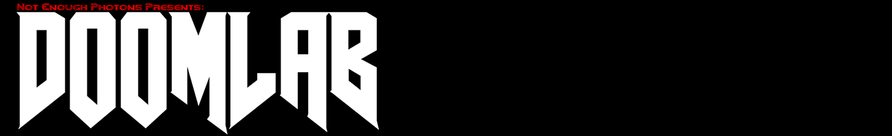

<html>
    

        
    

    
    

        

            
            
            
            
            
            
        

    

    
    

        

            
        

    

</html>
